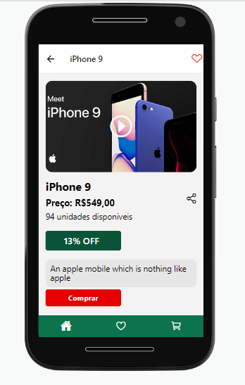

# Projeto de um aplicativo de produtos que simula uma loja virtual, com o Minicart usando Redux. Os produtos são provenientes de uma API.
### Funcionalidades
### 1 - Busca
### 2- Favoritar
### 3 - Minicart (com seletor de quantidade)

